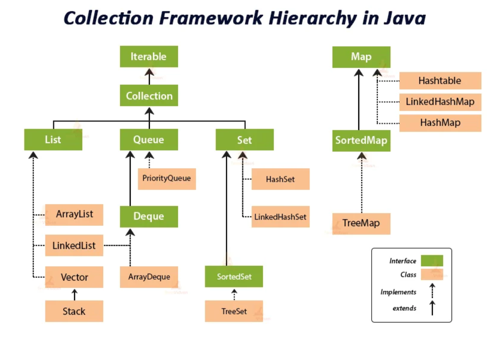

# Collection Framework
- **표준화한 설계**  
다수의 데이터를 효과적으로 처리할 수 있도록 표준화된 방법을 제공하는 클래스의 집합이다.
- **기능 공통화**  
다수의 데이터 처리에 필요한 대부분의 기능들을 공통화하고, `데이터를 저장`하는 자료 구조와 `데이터를 처리`하는 알고리즘을 구조화하여 클래스로 구현해놓은 것이다.  
- **인터페이스 구현**  
이러한 컬렉션 프레임워크는 인터페이스를 사용하여 구현된다.  
  컬렉션 프레임워크의 모든 클래스는 **List**와 **Set**, **Map** 인터페이스 중 하나의 인터페이스를 구현하고 있다.

## 핵심 인터페이스

컬렉션 프레임워크의 모든 클래스는 **List**와 **Set**, **Map** 인터페이스 중 하나의 인터페이스를 구현하고 있다.
- [List]()  
순서가 있는 데이터의 집합으로, 데이터의 중복을 허용  
`ArrayList` `LinkedList` `Stack` `Queue`
- [Set]()  
순서가 없는 데이터의 집합으로, 데이터의 중복을 허용하지 않음  
`HashSet` `TreeSet`
- [Map]()  
Key와 Value의 쌍으로 이루어진 데이터 집합으로, 순서가 없음  
Key는 중복을 허용하지 않으며, Value는 중복을 허용한다.  
`HashMap` `TreeMap`